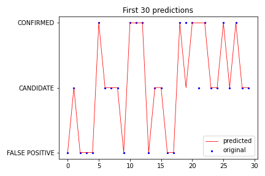
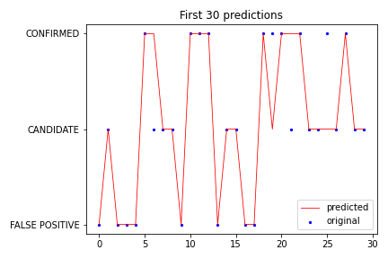

# Machine Learning Homework - Exoplanet Exploration

# Background
[Project Details](project_instructions_README.md)

# Overview
Over a period of nine years in deep space, the NASA Kepler space telescope has been out on a planet-hunting mission to discover hidden planets outside of our solar system.

To help process this data, machine learning models were created capable of classifying candidate exoplanets from the raw dataset.
* Random Forest Model
* K-Nearest Neighbor Model
* Support Vector Machines (SVM) Model

# Data
The data that was provided for this challenge is a subset of the data found at Kaggle:
https://www.kaggle.com/nasa/kepler-exoplanet-search-results

A full right up of all of the columns can be reviewed at :
https://exoplanetarchive.ipac.caltech.edu/docs/API_kepcandidate_columns.html

The following are definitions for the data that is included in the provided data.
|Data Column Name    | Table Label                                  | Description                                                                                                                                                                                                      |
|--------------------|----------------------------------------------|------------------------------------------------------------------------------------------------------------------------------------------------------------------------------------------------------------------|
| koi_fpflag_nt      |Not Transit-Like Flag                         |A KOI whose light curve is not consistent with that of a transiting planet. This includes, but is not limited to, instrumental artifacts, non-eclipsing variable stars, and spurious (very low SNR) detections.   |
| koi_fpflag_ss      |Stellar Eclipse Flag                          |A KOI that is observed to have a significant secondary event, transit shape, or out-of-eclipse variability, which indicates that the transit-like event is most likely caused by an eclipsing binary. However, self-luminous, hot Jupiters with a visible secondary eclipse will also have this flag set, but with a disposition of PC.|
| koi_fpflag_co      |Centroid Offset Flag                          |The source of the signal is from a nearby star, as inferred by measuring the centroid location of the image both in and out of transit, or by the strength of the transit signal in the target's outer (halo) pixels as compared to the transit signal from the pixels in the optimal (or core) aperture.|
| koi_fpflag_ec      |Ephemeris Match Indicates Contamination Flag  |The KOI shares the same period and epoch as another object and is judged to be the result of flux contamination in the aperture or electronic crosstalk.|                                                                                                                                                                                                                                                                                        
| koi_period         |Orbital Period (days)                         |The interval between consecutive planetary transits.|                                                                                                                                                                                                                                                                                                                                                                                             
| koi_period_err1    |Uncertainties Column (positive +) (negative -)|                                                                                |                                                                                                                                                                                                                                                                                                                                                           
| koi_period_err2    |Uncertainties Column (positive +) (negative -)|                                                                                |                                                                                                                                                                                                                                                                                                                                                            
| koi_time0bk        |Transit Epoch (BJD - 2,454,833.0)             |The time corresponding to the center of the first detected transit in Barycentric Julian Day (BJD) minus a constant offset of 2,454,833.0 days. The offset corresponds to 12:00 on Jan 1, 2009 UTC.|                                                                                                                                                                                                                                             
| koi_time0bk_err1   |Uncertainties Column (positive +) (negative -)|                                                                                    |                                                                                                                                                                                                                                                                                                                                                              
| koi_time0bk_err2   |Uncertainties Column (positive +) (negative -)|                                                                                    |                                                                                                                                                                                                                                                                                                                                                           
| koi_impact         |Impact Parameter                              |The sky-projected distance between the center of the stellar disc and the center of the planet disc at conjunction, normalized by the stellar radius. |                                                                                                                                                                                                                                                                                             
| koi_impact_err1    |Uncertainties Column (positive +) (negative -)|                                                                                     |                                                                                                                                                                                                                                                                                                                                                         
| koi_impact_err2    |Uncertainties Column (positive +) (negative -)|                                                                                      |                                                                                                                                                                                                                                                                                                                                                         
| koi_duration       |Transit Duration (hours)                      |The duration of the observed transits. Duration is measured from first contact between the planet and star until last contact. Contact times are typically computed from a best-fit model produced by a Mandel-Agol (2002) model fit to a multi-quarter Kepler light curve, assuming a linear orbital ephemeris.|
| koi_duration_err1  |Uncertainties Column (positive +) (negative -)|                                                                                       |                                                                                                                                                                                                                                                                                                                                                             
| koi_duration_err2  |Uncertainties Column (positive +) (negative -)|                                                                                       |                                                                                                                                                                                                                                                                                                                                                            
| koi_depth          |Transit Depth (parts per million)             |The fraction of stellar flux lost at the minimum of the planetary transit. Transit depths are typically computed from a best-fit model produced by a Mandel-Agol (2002) model fit to a multi-quarter Kepler light curve, assuming a linear orbital ephemeris |                                                                                                                                                                                        
| koi_depth_err1     |Uncertainties Column (positive +) (negative -)|                                                                                                                                                                                                                                                                                                                                                                                                                                                    
| koi_depth_err2     |Uncertainties Column (positive +) (negative -)|                                                                                                                                                                                                                                                                                                                                                                                                                                               
| koi_prad           |Planetary Radius (Earth radii)                |The radius of the planet. Planetary radius is the product of the planet star radius ratio and the stellar radius.                                                                                                                                                                                                                                                                                                                               
| koi_prad_err1      |Uncertainties Column (positive +) (negative -)|                                                                                                                                                                                                                                                                                                                                                                                                                                               
| koi_prad_err2      |Uncertainties Column (positive +) (negative -)|                                                                                                                                                                                                                                                                                                                                                                                                                                               
| koi_teq            |Equilibrium Temperature (Kelvin)              |Approximation for the temperature of the planet. The calculation of equilibrium temperature assumes a) thermodynamic equilibrium between the incident stellar flux and the radiated heat from the planet, b) a Bond albedo (the fraction of total power incident upon the planet scattered back into space) of 0.3, c) the planet and star are blackbodies, and d) the heat is evenly distributed between the day and night sides of the planet.   |
| koi_insol          |Insolation Flux [Earth flux]                  |Insolation flux is another way to give the equilibrium temperature. It depends on the stellar parameters (specifically the stellar radius and temperature), and on the semi-major axis of the planet. It's given in units relative to those measured for the Earth from the Sun. |                                                                                                                                                               
| koi_insol_err1     |Uncertainties Column (positive +) (negative -)|                                     |                                                                                                                                                                                                                                                                                                                                                                                                          
| koi_insol_err2     |Uncertainties Column (positive +) (negative -)|                                    |                                                                                                                                                                                                                                                                                                                                                                                                           
| koi_model_snr      |Transit Signal-to-Noise                       |Transit depth normalized by the mean uncertainty in the flux during the transits.|                                                                                                                                                                                                                                                                                                                                                                  
| koi_tce_plnt_num   |TCE Planet Number"                            |TCE Planet Number federated to the KOI. |                                                                                                                                                                                                                                                                                                                                                                                                         
| koi_steff          |Stellar Effective Temperature (Kelvin)        |The photospheric temperature of the star. |                                                                                                                                                                                                                                                                                                                                                                                                         
| koi_steff_err1     |Uncertainties Column (positive +) (negative -)|                                                                                                                                                                                                                                                                                                                                                                                                                                               
| koi_steff_err2     |Uncertainties Column (positive +) (negative -)|                                                                                                                                                                                                                                                                                                                                                                                                                                               
| koi_slogg          |Stellar Surface Gravity (log10(cm s-2)        |The base-10 logarithm of the acceleration due to gravity at the surface of the star. |                                                                                                                                                                                                                                                                                                                                                           
| koi_slogg_err1     |Uncertainties Column (positive +) (negative -)|                              |                                                                                                                                                                                                                                                                                                                                                                                                                 
| koi_slogg_err2     |Uncertainties Column (positive +) (negative -)|                               |                                                                                                                                                                                                                                                                                                                                                                                                                
| koi_srad           |Stellar Radius (solar radii)                  |The photospheric radius of the star    |                                                                                                                                                                                                                                                                                                                                                                                                         
| koi_srad_err1      |Uncertainties Column (positive +) (negative -)|                               |                                                                                                                                                                                                                                                                                                                                                                                                                
| koi_srad_err2      |Uncertainties Column (positive +) (negative -)|                               |                                                                                                                                                                                                                                                                                                                                                                                                               
| ra                 |RA (deg)                                      |KIC Right Ascension               |                                                                                                                                                                                                                                                                                                                                                                                                             
| dec                |Dec (deg)                                     |KIC Declination      |                                                                                                                                                                                                                                                                                                                                                                                                                      
| koi_kepmag         |Kepler-band (mag)                             |Kepler-band (mag)                                                                                                                  

The data utilized can be viewed [here](https://raw.githubusercontent.com/blt1339/machine-learning-challenge/main/data/exoplanet_data.csv)                                                                                                            
# Directory
The data is stored in the directory 'data' as exoplanet_data.csv.  This data is a subset of the data found [here](https://www.kaggle.com/nasa/kepler-exoplanet-search-results)

All Juypter Notebooks are in the directory 'code':
* model_KNN.ipynb
* model_random_forest.ipynb
* model_SVM.ipynb

All of the search grids and best param models are stored in the directory 'models':
* grid_KNN.sav
* model_KNN.sav
* grid_SVM.sav
* model_SVM.sav
* grid_random_forest.sav
* model_random_forest.sav

# Models
For all models, I started using all features.   For the random forest model and the SVM model.   But that did not give a good enough score for the K-Nearest Neighbor Model.   I was able to come up with a list of features that did allow a score greater than .85 for the KNN model and also produced the best score for the Random Forest Model but using all features generated the better score for the SVM Model

## Random Forest Model
Using all features generated the following scores:
* Best Random Forest Training Data Score: 0.9998092695021934
* Best Random Forest Testing Data Score: 0.8907322654462243

But using the following features generated an even better score:
* koi_fpflag_nt
* koi_fpflag_ss
* koi_fpflag_co
* koi_fpflag_ec
* koi_period
* koi_period_err1
* koi_period_err2
* koi_time0bk
* koi_time0bk_err1
* koi_time0bk_err2
* koi_impact
* koi_impact_err1
* koi_impact_err2
* koi_duration
* koi_duration_err1
* koi_duration_err2
* koi_depth
* koi_depth_err1
* koi_depth_err2
* koi_prad
* koi_prad_err1
* koi_prad_err2

### Random Forest Model Results
  |               | BeforeCV           |       Grid        |    Best Params    |
  |:-------------:|:------------------:|:-----------------:|:-----------------:|
  |Training Score | 1.0                | 0.9969483120350944|0.9954224680526416 |
  |Testing Score  | 0.8901601830663616 | 0.8947368421052632|0.8953089244851259 |
 
### Best Params
 'max_depth': 20, 'max_features': 'sqrt', 'n_estimators': 50
### Classification Report
                   precision    recall  f1-score   support

      CANIDATE       0.81      0.76      0.79       411
     CONFIRMED       0.82      0.83      0.83       484
FALSE POSITIVE       0.98      0.99      0.98       853

      accuracy                           0.90      1748
     macro avg       0.87      0.86      0.87      1748
  weighted avg       0.89      0.90      0.89      1748

# K-Nearest Neighbor Model                     
The following features were utilized for our best score for K-Nearnest Neighbor model:
* koi_fpflag_nt
* koi_fpflag_ss
* koi_fpflag_co
* koi_fpflag_ec
* koi_period
* koi_period_err1
* koi_period_err2
* koi_time0bk
* koi_time0bk_err1
* koi_time0bk_err2
* koi_impact
* koi_impact_err1
* koi_impact_err2
* koi_duration
* koi_duration_err1
* koi_duration_err2
* koi_depth
* koi_depth_err1
* koi_depth_err2
* koi_prad
* koi_prad_err1
* koi_prad_err2                     
                     
### K-Nearest Neighbor Model Results                     
  |               | BeforeCV           |       Grid        |    Best Params    |
  |:-------------:|:------------------:|:-----------------:|:-----------------:|
  |Training Score | 0.9099752050352852 | 1.0               | 1.0               |
  |Testing Score  | 0.8838672768878718 | 0.8878718535469108| 0.8878718535469108 |                     

### Best Params
### Classification Report
                precision    recall  f1-score   support

      CANIDATE       0.82      0.70      0.76       411
     CONFIRMED       0.78      0.85      0.81       484
FALSE POSITIVE       0.98      1.00      0.99       853

      accuracy                           0.89      1748
     macro avg       0.86      0.85      0.85      1748
  weighted avg       0.89      0.89      0.89      1748

# Support Vector Machines (SVM) Model                     
The same features that were used for the other two models were tried for the SVM model but a better score was received when using all features available.  

When only using the features that were utilized in other two models the following were the scores:
* Best SVM Training Data Score: 0.8785046728971962
* Best SVM Testing Data Score: 0.8672768878718535

Since a better score was received when using all features, all features were utilized:
* koi_fpflag_nt
* koi_fpflag_ss
* koi_fpflag_co
* koi_fpflag_ec
* koi_period
* koi_period_err1
* koi_period_err2
* koi_time0bk
* koi_time0bk_err1
* koi_time0bk_err2
* koi_impact
* koi_impact_err1
* koi_impact_err2
* koi_duration
* koi_duration_err1
* koi_duration_err2
* koi_depth
* koi_depth_err1
* koi_depth_err2
* koi_prad
* koi_prad_err1
* koi_prad_err2
* koi_teq
* koi_insol
* koi_insol_err1
* koi_insol_err2
* koi_model_snr
* koi_tce_plnt_num
* koi_steff
* koi_steff_err1
* koi_steff_err2
* koi_slogg
* koi_slogg_err1
* koi_slogg_err2
* koi_srad
* koi_srad_err1
* koi_srad_err2
* ra
* dec
* koi_kepmag
### SVM Model Results                     
  |               | BeforeCV           |       Grid        |    Best Params    |
  |:-------------:|:------------------:|:-----------------:|:-----------------:|
  |Training Score | 0.8455082967766546 | 0.8865153538050734|0.8865153538050734 |
  |Testing Score  | 0.8415331807780321 | 0.8792906178489702|0.8792906178489702 |                     

### Best Params
'C': 50, 'gamma': 0.0001, 'kernel': 'linear'
### Classification Report
                precision    recall  f1-score   support

      CANIDATE       0.81      0.67      0.73       411
     CONFIRMED       0.76      0.85      0.80       484
FALSE POSITIVE       0.98      1.00      0.99       853

      accuracy                           0.88      1748
     macro avg       0.85      0.84      0.84      1748
  weighted avg       0.88      0.88      0.88      1748

# Summary
The final models for all three types were able to achieve a score over 0.85.  The model that took the most work was the K-Nearest Neighbor model.    The other two models achieved that score using all of the features.   But it took reducing the features for the KNN to achieve the desired score.  The SVM Model gained the most score increase by utilzing the search grid. The score for that model started out below .85 but increased over that threshold via tuning.